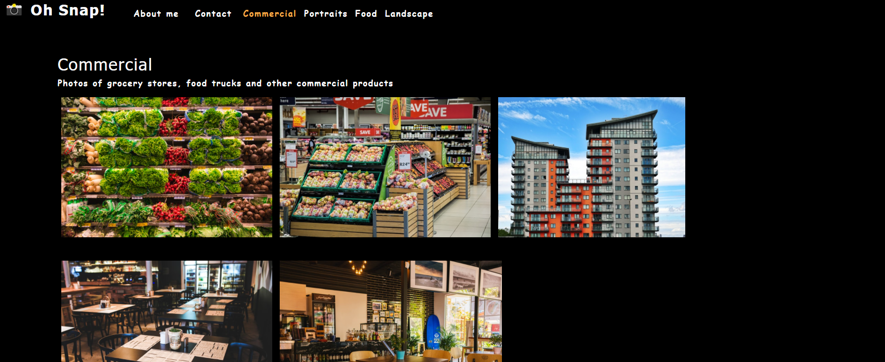

# Photo Port

## Description

Advertise your photographical achievements with this photography based portfolio. Photoport is a front-end only application that uses React as a single page application
## Table of Contents
* [Usage](#usage)
* [License](#license)
* [Questions](#questions)
## Usage
Simply Navigate to the link below

https://blazelim.github.io/photo-port/
## License
This project is covered under the MIT license.
[Click here to see the terms of the license](https://choosealicense.com/licenses/mit/)
## Questions
Any questions or concerns?
Contact me on my github: [blazelim](https://github.com/blazelim/)

Or email me at: blazebentleycolim@gmail.com
